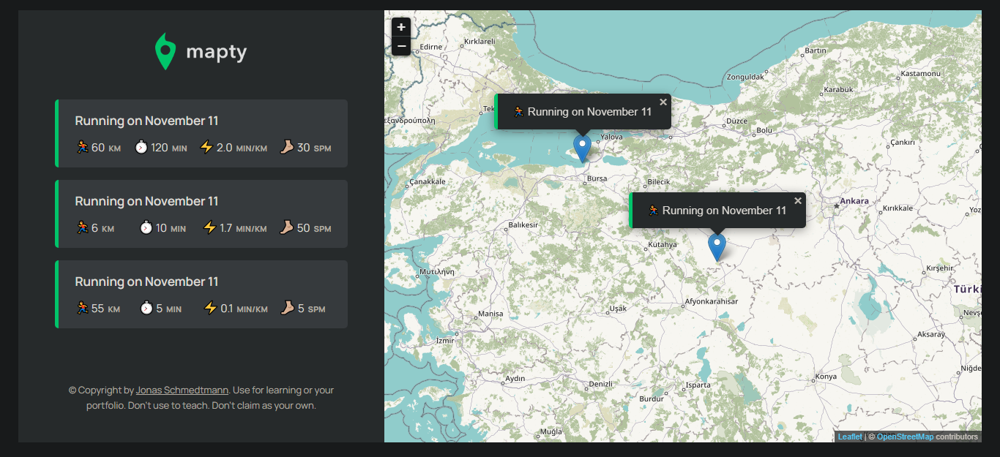

<div id="top"></div>


<!-- PROJECT LOGO -->
<br />
<div align="center">
    

<h1>Mapty</h1>

  <p align="center">
    <a href="https://mapty.netlify.app/">View Demo</a>
  </p>
</div>

<!-- TABLE OF CONTENTS -->
<details>
  <summary>Table of Contents</summary>
  <ol>
    <li>
      <a href="#about-the-project">About The Project</a>
      <ul>
        <li><a href="#built-with">Built With</a></li>
        <li><a href="#flowchart">Flowchart</a></li>
        <li><a href="#architecture">Architecture</a></li>
      </ul>
    </li>
    <li>
      <a href="#getting-started">Getting Started</a>
      <ul>
        <li><a href="#installation">Installation</a></li>
      </ul>
    </li>
    <li><a href="#contributing">Contributing</a></li>
    <li><a href="#acknowledgments">Acknowledgments</a></li>
  </ol>
</details>

<!-- ABOUT THE PROJECT -->

## About The Project

workouts logging page for Cycling and Running using map from [Leaflet library](https://leafletjs.com/SlavaUkraini/index.html)

- Features :
  - Display location on map
  - Submit workouts on any location on the map
  - Select workout type : (running / cycling)
  - Render workout on the map
  - User's workouts are saved using `local-storage` API
  - Reset button to delete all user's data



<p align="right">(<a href="#top">back to top</a>)</p>

### Built With

- HTML
- CSS
- JavaScript
- Leaflet library

### Flowchart


### Architecture


<p align="right">(<a href="#top">back to top</a>)</p>

<!-- GETTING STARTED -->

## Getting Started

This project doesn't require any prequesites or dependenscies and you can view it online using this [demo](https://mapty.netlify.app/).

> To get a local copy up and running follow these simple steps :

### Installation

1. Clone the repo
   ```sh
   git clone https://github.com/SalahShallapy/Mapty
   ```
2. open `index.html` file

<p align="right">(<a href="#top">back to top</a>)</p>

<!-- CONTRIBUTING -->

## Contributing

Contributions are what make the open source community such an amazing place to learn, inspire, and create. Any contributions you make are **greatly appreciated**.

If you have a suggestion that would make this better, please fork the repo and create a pull request. You can also simply open an issue with the tag "enhancement".
Don't forget to give the project a star! Thanks!

1. Fork the Project
2. Create your Feature Branch (`git checkout -b feature/AmazingFeature`)
3. Commit your Changes (`git commit -m 'Add some AmazingFeature'`)
4. Push to the Branch (`git push origin feature/AmazingFeature`)
5. Open a Pull Request

<p align="right">(<a href="#top">back to top</a>)</p>
